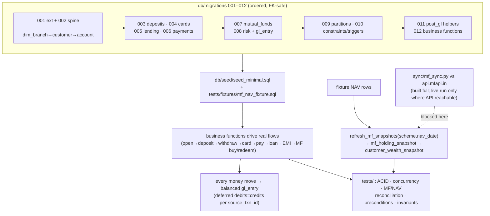

# PostgreSQL Implementation Plan — Banking POC (25-table Data Model)

## Context

`Entire Story + Data Model.md` specifies a 25-table banking POC (Customer/Account spine, Retail
Deposits, Cards, Lending, Payments, Mutual Funds, Finance & Risk) with a central `gl_entry` ledger.
The doc is written for a Fabric/Lakehouse medallion architecture, but the requirement here is a **real
transactional PostgreSQL database** that implements the model correctly: strict ACID, real-world flow
enforcement, spend-≤-balance guarantees under concurrency, balanced double-entry ledger postings, and
a **real-time Mutual-Fund sync** off `api.mfapi.in` that propagates NAVs into derived snapshots.

The repo is greenfield: only the spec and one AMFI NAV parser
(`mutual funds parser/Mutual_Funds_Parser.py`) exist. That parser hits AMFI's `NAVAll.txt`; the spec
and requirement #4 mandate `api.mfapi.in`, so the sync job is built fresh against mfapi.in — reusing
only the parser's NAV-cleaning idea (`pd.to_numeric` on the string NAV, `DD-MM-YYYY`→date, `errors=
"coerce"` to drop bad rows, sort ascending).

### Environment facts established during planning (these settle the draft's open items)

- **PostgreSQL 16.13 is installed locally** (`psql` present; cluster `16/main` on :5432, currently
  **down**). Target = this local cluster (confirmed). PG 16 supports every partitioning/FK feature the
  plan uses. Verification starts it with `pg_ctlcluster 16 main start` (or `pg_ctl`), then creates a
  fresh `bank_poc` database.
- **`api.mfapi.in` is blocked by this environment's egress policy** — the agent proxy returns a 403
  policy denial (confirmed via `$HTTPS_PROXY/__agentproxy/status`). Per proxy policy we do **not**
  route around it. Consequence (confirmed with user): `sync/mf_sync.py` is written **in full** against
  mfapi.in so it runs wherever the API is reachable, but **all tests and in-session verification use a
  committed real-shaped NAV fixture** loaded straight into `fact_mf_nav`. The live backfill/refresh is
  documented in the README for a networked environment.
- **Python 3.11**, `requests` present, **`psycopg2` NOT installed**. `pypi.org` / `files.pythonhosted.org`
  are allowed through the proxy, so `pip install psycopg2-binary` works. Add it to `sync/requirements.txt`
  and install during setup.

**Confirmed scope decisions:**
1. **Minimal seed now, millions later** — schema, functions, real-shaped MF data (via fixture here /
   live feed elsewhere), and a small hand-built seed sufficient to exercise every function and test.
   Partitioning and generation order are designed so bulk generation drops in later with no schema change.
2. **MF buys use a full cash leg** — `buy_mutual_fund` requires a linked deposit settlement account,
   debits it (writes `fact_deposit_txn` + balanced `gl_entry`), and validates the amount against
   available balance before buying. (Overrides the spec's "settlement_account_id not actively used"
   note, per requirement #3.)
3. **Target PostgreSQL** = the local PG 16 cluster. Migrations use portable syntax (`ON CONFLICT`,
   not `MERGE`) so they also run against any external PG ≥ 12 later.

---

## Ambiguities found in the spec & assumed resolutions

| # | Ambiguity | Resolution (assumption) |
|---|---|---|
| A1 | "Available balance" formula not stated | `savings`/`checking`: `current_balance − min_balance`. `overdraft`: `current_balance + overdraft_limit` (min_balance treated as 0). `term`: locked → withdrawals rejected until `maturity_date`, then treated as savings. |
| A2 | Card "available credit" not defined | Credit cards: `available_credit = credit_limit − current_statement_balance`; a purchase increases `current_statement_balance`. `make_card_purchase` handles **credit** cards only; debit/prepaid are out of scope for the limit check. |
| A3 | `settlement_account_id` "not actively used" vs req #3 | Full cash leg (decision #2). `buy_mutual_fund`/`redeem_mutual_fund`/`post_emi_payment` require a valid deposit account and move real money through it. |
| A4 | Does a payment also write `fact_deposit_txn`? | No double-debit: `make_payment` debits the deposit balance once and records it in `fact_payment` only (its own GL posting keyed by `payment_id`). |
| A5 | GL chart-of-accounts folded into columns — no COA table | Fixed `gl_code`/`gl_category` string constants inside a `post_gl()` helper. Bank's book view: customer deposits = liability, cash/clearing = asset, loan & card receivable = asset, interest/interchange = income. |
| A6 | `fact_mf_nav` PK is `nav_id` but partitioning needs the partition key in the PK | PK becomes `(scheme_code, nav_date)` (partition key included + the natural key the FK targets); `nav_id` kept as a derived business column with a plain (non-PK) unique-ish value. Same pattern for all partitioned facts: PK = `(business_id, <partition_date>)`, business_id also carried as a column. |
| A7 | MF snapshot grain is monthly, but req #4 wants real-time reflect | Real-time refresh upserts the **current-period** snapshot keyed on `(folio_id, scheme_code, date_trunc('month', nav_date))` using the latest NAV; historical monthly snapshots stay a generation concern. Keeps `market_value = units_held × nav_value` always true. |
| A8 | Live MF units have no balance row (snapshots are monthly) | `redeem_mutual_fund` computes net units from `fact_mf_transaction` and serializes per folio via `SELECT … FOR UPDATE` on the `mf_folio` row to prevent over-redemption races. |

---

## Shape of the build



The live feed (dotted) is the only piece that cannot execute in this session; the fixture feeds the
same `refresh_mf_snapshots` DB function the live refresh calls, so everything downstream is verified.

---

## Part 1 — Schema design (table-by-table DDL)

**Type mapping:** `STRING → text`, `INT → integer`, `BIGINT → bigint`, `DECIMAL(p,s) → numeric(p,s)`,
`DATE → date`, `TIMESTAMP → timestamptz`, `BOOLEAN → boolean`.

**Global rules for every table:** PK + FK exactly per spec; `NOT NULL` on every non-nullable column;
enum-like text columns get `CHECK (col IN (…))`; money columns `CHECK (amount >= 0)` where a sign is
implied by `dr_cr`/`txn_type`; `created_at timestamptz DEFAULT now()` audit column (non-spec,
harmless). Migrations ordered to satisfy FK dependencies per the spec's "Load / generation order".

### Migration file order (mirrors spec dependency graph)

| File | Tables / objects |
|---|---|
| `001_extensions.sql` | `pgcrypto` (id generation), session defaults |
| `002_reference_spine.sql` | `dim_branch` → `dim_customer` → `dim_account` |
| `003_deposits.sql` | `deposit_account`, `fact_deposit_txn` *(partitioned)* |
| `004_cards.sql` | `card_master`, `dim_merchant`, `fact_card_txn` *(partitioned)* |
| `005_lending.sql` | `loan_application`, `loan_account`, `repayment_schedule` *(part.)*, `fact_loan_txn`, `loan_delinquency` |
| `006_payments.sql` | `dim_beneficiary`, `fact_payment` *(partitioned)* |
| `007_mutual_funds.sql` | `dim_amc` → `dim_mf_scheme` → `fact_mf_nav` *(part.)* → `mf_folio` → `fact_mf_transaction` *(part.)* → `mf_holding_snapshot` *(part.)* |
| `008_risk_and_gl.sql` | `credit_bureau_score`, `risk_alert`, `customer_wealth_snapshot` *(part.)*, `gl_entry` *(part.)* |
| `009_partitions.sql` | `create_month_partitions()` / `create_year_partitions()` helpers + initial partitions + `DEFAULT` partitions |
| `010_constraints_triggers.sql` | deferred constraint triggers + row triggers (below) |
| `011_gl_helpers.sql` | `post_gl()` / `post_gl_split()` |
| `012_functions.sql` | all transactional business functions + `refresh_mf_snapshots()` |

### Partitioning

Native **RANGE** partitioning on the seven fact tables the spec flags; PK includes the partition-key
column (A6):

| Table | Partition key | Granularity |
|---|---|---|
| `fact_deposit_txn` | `txn_date` | month |
| `fact_card_txn` | `txn_date` | month |
| `fact_payment` | `payment_date` | month |
| `fact_mf_transaction` | `txn_date` | month |
| `repayment_schedule` | `due_date` | month |
| `gl_entry` | `posting_date` | month |
| `fact_mf_nav` | `nav_date` | **year** (per spec "by year or month") |

`create_month_partitions(table, from_date, to_date)` and `create_year_partitions(...)` generate child
partitions; a `DEFAULT` partition on each catches out-of-range rows so inserts never fail on a missing
partition. The `fact_mf_transaction (scheme_code, nav_date) → fact_mf_nav (scheme_code, nav_date)` FK
targets the composite PK of the partitioned `fact_mf_nav` (partition key included → legal in PG 16).

### Constraints & triggers (spec's "DE note" invariants made real)

| Invariant (source) | Mechanism |
|---|---|
| `fact_mf_transaction (scheme_code, nav_date)` must exist in `fact_mf_nav` | **FK** to `fact_mf_nav (scheme_code, nav_date)` |
| `fact_mf_transaction`: `units = amount ÷ nav_value`, `nav_value` copied from real NAV | **BEFORE INSERT trigger** looks up authoritative `nav_value` from `fact_mf_nav`, sets `NEW.nav_value`, sets `NEW.units = round(amount/nav_value, 5)`; plus `CHECK (abs(units*nav_value − amount) <= 0.01)` |
| `mf_holding_snapshot`: `market_value = units × nav_value`, `unrealised_gain = market_value − invested_amount` | **CHECK** constraints (0.01 tolerance) |
| `repayment_schedule`: Σ `principal_component` per loan = `loan_account.principal` | **DEFERRABLE INITIALLY DEFERRED constraint trigger** (checked at commit; installments insert incrementally) |
| `gl_entry`: per `source_txn_id`, Σ debit = Σ credit | **DEFERRABLE INITIALLY DEFERRED constraint trigger** on `source_txn_id` |
| `credit_bureau_score.score` in 300–900 | **CHECK** |
| `customer_wealth_snapshot.total_relationship_value = deposit_balance + mf_aum` | **CHECK** (0.01 tolerance) |
| account/card/loan status, `dr_cr`, `kyc_status`, `account_type`, txn types, etc. | **CHECK … IN (…)** enumerations |
| No transaction on a closed/written-off account | enforced in functions (status check under lock) + FK to `dim_account` |

---

## Part 2 — Transactional functions (PL/pgSQL) — flow, preconditions, locking

**Isolation strategy (justification):** every function runs at **READ COMMITTED** (default) and takes
an explicit **`SELECT … FOR UPDATE`** on the balance/limit row *before* validating and debiting. The
row lock provides the mutual exclusion that prevents lost-update/overdraw races; after acquiring it the
function re-reads the *fresh committed* balance and decides. Cheaper and retry-free versus
`SERIALIZABLE`/`REPEATABLE READ`, which would force serialization-failure retry loops for the same
guarantee. Where the check spans an aggregate rather than one row (MF net units, A8), we serialize on
the parent `mf_folio` row with `FOR UPDATE`. Every function is one transaction: any raised exception
rolls back **all** writes — balance, fact, and ledger — no partial state, not even a ledger row.

| Function | Preconditions (validated before any write) | Lock | Writes (all atomic) |
|---|---|---|---|
| `open_deposit_account(cust, product, type, …)` | customer exists, `kyc_status='verified'`, `status='active'` | — | `dim_account` (type=deposit) + `deposit_account` |
| `deposit_to_account(acct, amount, channel, narration)` | account exists, `status='active'`, `amount>0` | `FOR UPDATE` on `deposit_account` | balance += ; `fact_deposit_txn` (credit, running_balance); `post_gl` |
| `withdraw_from_deposit(acct, amount, channel, narration)` | account active; **available balance (A1) ≥ amount**; term deposit not locked | `FOR UPDATE` on `deposit_account` | balance −= ; `fact_deposit_txn` (debit); `post_gl` (Dr customer-deposits / Cr cash-clearing) |
| `make_card_purchase(card, merchant, amount, entry_mode, …)` | card `status='active'`, not expired, `card_type='credit'`; **available_credit (A2) ≥ amount** | `FOR UPDATE` on `card_master` | `current_statement_balance += `; `fact_card_txn`; `post_gl` (Dr card-receivable / Cr merchant-clearing) |
| `make_payment(from_acct, beneficiary, rail, amount, …)` | from-account active deposit; beneficiary belongs to same customer; **available balance ≥ amount** | `FOR UPDATE` on `deposit_account` | balance −= ; `fact_payment` (A4, single debit); `post_gl` (Dr customer-deposits / Cr payment-clearing) |
| `approve_loan_application(app, approved_amount)` | app `decision='pending'`; reads **latest** `credit_bureau_score`; enforces score ≥ threshold | `FOR UPDATE` on `loan_application` | sets `decision`, `approved_amount`, `decision_date` |
| `disburse_loan(app, disbursal_acct)` | app `decision='approved'`, `approved_amount` not null, no existing `loan_account` for app; disbursal account active | `FOR UPDATE` on `loan_application` + disbursal `deposit_account` | `dim_account`(type=loan) + `loan_account`; amortized `repayment_schedule` (principal sums to principal); `fact_loan_txn`(disbursal); credit disbursal deposit acct + `fact_deposit_txn`; `post_gl` (Dr loan-receivable / Cr customer-deposits) |
| `post_emi_payment(loan, pay_from_acct, amount, txn_date)` | loan `status='active'`; pay-from account active; **available balance ≥ amount** | `FOR UPDATE` on `loan_account` + `deposit_account` | debit deposit + `fact_deposit_txn`; `fact_loan_txn`(emi) split principal/interest from schedule; `loan_account.outstanding_principal −= principal_paid`; mark `repayment_schedule` installment `paid`; `post_gl_split` (Dr deposit-clearing / Cr loan-receivable + Cr interest-income) |
| `buy_mutual_fund(folio, scheme, nav_date, amount, txn_type, is_sip)` | folio `active`; `settlement_account_id` **not null** + active deposit; `(scheme, nav_date)` in `fact_mf_nav`; **settlement available balance ≥ amount** | `FOR UPDATE` on settlement `deposit_account` + `mf_folio` | debit settlement + `fact_deposit_txn` + `post_gl`; `fact_mf_transaction`(purchase/sip, units via trigger) + `post_gl` (Dr mf-investments / Cr mf-settlement) |
| `redeem_mutual_fund(folio, scheme, nav_date, units)` | folio active; `(scheme, nav_date)` in `fact_mf_nav`; **net units held (A8) ≥ units** | `FOR UPDATE` on `mf_folio` + settlement `deposit_account` | `fact_mf_transaction`(redemption) + `post_gl`; credit settlement + `fact_deposit_txn` + `post_gl` |

**GL helpers:** `post_gl(source_domain, source_txn_id, dr_code, cr_code, category, amount, posting_date)`
inserts two balanced rows; `post_gl_split(…)` supports one debit + multiple credits summing to it (EMI).
The deferred `gl_entry` balance trigger guarantees debits = credits per `source_txn_id` at commit
regardless of which helper ran.

---

## Part 3 — MF real-time sync — `sync/mf_sync.py`

Python (`requests` + `psycopg2`), reusing the parser's cleaning approach (`sed`-free: pandas-style
`to_numeric(errors='coerce')`, `DD-MM-YYYY`→date) against `api.mfapi.in`. Config-driven curated scheme
list (`sync/config.py`, ~500 per spec, small subset for the test run) so backfill is bounded.
`sync/requirements.txt` pins `requests` + `psycopg2-binary`. All HTTP calls read `HTTPS_PROXY`
naturally (requests honors it) and set `REQUESTS_CA_BUNDLE=/root/.ccr/ca-bundle.crt`.

> **Runs where mfapi.in is reachable.** In *this* environment the API is egress-blocked, so the live
> commands are documented but not executed; the DB-side `refresh_mf_snapshots` is exercised via the
> fixture instead (Part 5). No code changes needed to run live elsewhere.

**Endpoints:** `GET /mf` → `[{schemeCode, schemeName}]`; `GET /mf/{code}` →
`{meta:{fund_house, scheme_type, scheme_category, isin_growth, …}, data:[{date:'DD-MM-YYYY', nav:'<str>'}]}`;
`GET /mf/{code}/latest` → newest row.

**One-time backfill:**
1. `GET /mf`, filter to the curated `scheme_code` list.
2. Per scheme, `GET /mf/{code}`: upsert `dim_amc` (from `meta.fund_house`), upsert `dim_mf_scheme`
   (category/type/plan/option/ISIN from `meta`).
3. Clean the `data` array — `nav`→`numeric` (drop non-numeric), `date` `DD-MM-YYYY`→`date`, **sort
   ascending**, **dedupe** on `(scheme_code, nav_date)` (last wins), skip gaps (weekends/holidays are
   normal). Bulk **upsert** `fact_mf_nav` via `INSERT … ON CONFLICT (scheme_code, nav_date) DO UPDATE`.
4. (Optional) land raw JSON to a `bronze_mf_raw` table for medallion fidelity.

**Repeatable refresh (daily / on-demand):**
1. Per scheme, `GET /mf/{code}/latest`, clean, upsert one `fact_mf_nav` row (idempotent).
2. Call, transactionally per `(scheme, nav_date)`, the DB function **`refresh_mf_snapshots(scheme_code,
   nav_date)`** which in one transaction:
   - recomputes each affected folio's `mf_holding_snapshot` for `date_trunc('month', nav_date)` (A7):
     `units_held` = Σ net units ≤ date, `invested_amount` = net purchase cost, `nav_value` = new NAV,
     `market_value = units_held × nav_value`, `unrealised_gain = market_value − invested_amount`;
   - rolls up each affected customer's `customer_wealth_snapshot`: `mf_aum` = Σ holdings'
     `market_value`, `deposit_balance` from `deposit_account`,
     `total_relationship_value = deposit_balance + mf_aum`, re-derive `wealth_segment`.
   One transaction per scheme/date → the DB is never left with a NAV that doesn't match its snapshot;
   the `market_value`/`total` CHECK constraints backstop it.

CLI: `python mf_sync.py backfill` / `mf_sync.py refresh [--schemes …]`. Retries + rate-limit backoff on
HTTP; every run fully idempotent. `refresh_mf_snapshots` lives in the DB (`012_functions.sql`) so it is
callable both by the live sync and directly in tests.

---

## Part 4 — Minimal seed (`db/seed/seed_minimal.sql`) + NAV fixture

**Seed:** enough to exercise every function, no bulk generation — a few `dim_branch`; KYC-`verified` and
one KYC-`pending` `dim_customer`; deposit accounts (savings, overdraft, one closed, one term); one
credit `card_master` + `dim_merchant`; one `dim_beneficiary`; one approved + one pending `loan_application`
with `credit_bureau_score` rows; `mf_folio` with a settlement deposit account.

**NAV fixture (`tests/fixtures/mf_nav_fixture.sql`):** a small, **real-shaped** set of `dim_amc` +
`dim_mf_scheme` + `fact_mf_nav` rows (a couple of schemes, ~10–20 NAV dates each, values in realistic
ranges, `numeric(14,5)`). This replaces the live backfill for in-session verification and tests so the
suite is self-contained and deterministic. When the live feed is reachable, `mf_sync.py backfill`
supersedes the fixture.

---

## Part 5 — Test plan (`tests/`)

Plain-SQL assertions run via `psql` (using `DO $$ … RAISE EXCEPTION …$$` / `ASSERT`), plus a Python
harness for true concurrency.

| Test | Asserts |
|---|---|
| `test_acid_rollback.sql` | Inject a failure mid-function (invalid arg / GL leg raises after the debit): deposit balance unchanged **and** zero rows added to the fact **and** zero rows in `gl_entry` — all-or-nothing. |
| `test_concurrency.py` | Two connections concurrently `withdraw_from_deposit` where the sum exceeds available: **exactly one succeeds**, the other errors, final balance never below `min_balance` (or below `−overdraft_limit`). Repeat for `make_card_purchase` over `credit_limit`. |
| `test_mf_consistency.sql` | `units = amount ÷ nav_value` after insert; insert with `nav_date` not in `fact_mf_nav` → rejected by FK; tampered `units`/`nav_value` → rejected by trigger/CHECK. |
| `test_reconciliation.sql` | After a mixed batch of operations, per `source_txn_id` Σ debit = Σ credit, and global Σ debit = Σ credit in `gl_entry`. |
| `test_flow_preconditions.sql` | Open account for KYC-`pending` customer → reject; transact on a `closed` account → reject; `disburse_loan` on `pending`/`rejected` app → reject; `fact_loan_txn` before disbursal impossible (no loan); `buy_mutual_fund` above settlement balance → reject with **nothing** written; MF txn on missing `nav_date` → reject. |
| `test_invariants.sql` | Bad `repayment_schedule` (principals not summing to principal) → rejected at commit by deferred trigger; `credit_bureau_score` outside 300–900 → rejected. |
| `test_mf_refresh.sql` | Load fixture → buy MF → call `refresh_mf_snapshots` → assert `mf_holding_snapshot.market_value = units × nav_value` and `customer_wealth_snapshot.total = deposit + mf_aum`. (Exercises the refresh path that the live feed would drive.) |

`tests/run_tests.py` (or a `Makefile`) creates a scratch database, applies `001..012`, loads the seed +
NAV fixture, then runs every test and reports pass/fail.

---

## Deliverable layout

```
db/migrations/001..012_*.sql          # ordered, FK-dependency-safe
db/seed/seed_minimal.sql
tests/fixtures/mf_nav_fixture.sql     # real-shaped NAV rows (stands in for live backfill)
sync/mf_sync.py  sync/config.py  sync/requirements.txt
tests/test_*.sql  tests/test_concurrency.py  tests/run_tests.py
README.md                             # setup, local PG start, run order, sync usage + egress note
```

---

## Verification (how we prove it works end-to-end, in this session)

1. **Start DB:** `pg_ctlcluster 16 main start` (fallback `pg_ctl -D /var/lib/postgresql/16/main start`);
   `createdb bank_poc`; `pip install -r sync/requirements.txt`.
2. **Apply schema:** run `001..012` → all 25 tables + partitions + constraints/triggers + functions
   created, load order clean.
3. **Load data:** `psql -f db/seed/seed_minimal.sql` + `psql -f tests/fixtures/mf_nav_fixture.sql` →
   `dim_amc`, `dim_mf_scheme`, `fact_mf_nav` populated with real-shaped data.
4. **Drive real flows via the functions:** open account → deposit → withdraw → card purchase → payment
   → approve+disburse loan → post EMI → buy MF (cash leg debits settlement) → redeem.
5. **Refresh path:** call `refresh_mf_snapshots(scheme, nav_date)` → confirm `mf_holding_snapshot` and
   `customer_wealth_snapshot` update transactionally and `market_value = units × nav_value`,
   `total = deposit + mf_aum` hold.
6. **Full suite:** `python tests/run_tests.py` (ACID rollback, concurrent overdraw, MF/NAV consistency,
   ledger reconciliation, flow preconditions, invariants, MF refresh) → all green; assert no
   negative/over-limit balances and debits = credits everywhere.
7. **Sync smoke (offline):** `python mf_sync.py refresh --help` and a dry parse of a saved sample JSON
   confirm the sync wiring; the live `mf_sync.py backfill` is left for a networked environment (README
   documents it) since `api.mfapi.in` is egress-blocked here.

## Notes carried forward
- Live MF feed is the only unverifiable piece in-session (egress policy). All DB behavior, including the
  snapshot-refresh that the feed drives, is verified via the fixture.
- Migrations stay portable (PG ≥ 12) so they also apply to any external server provided later.
